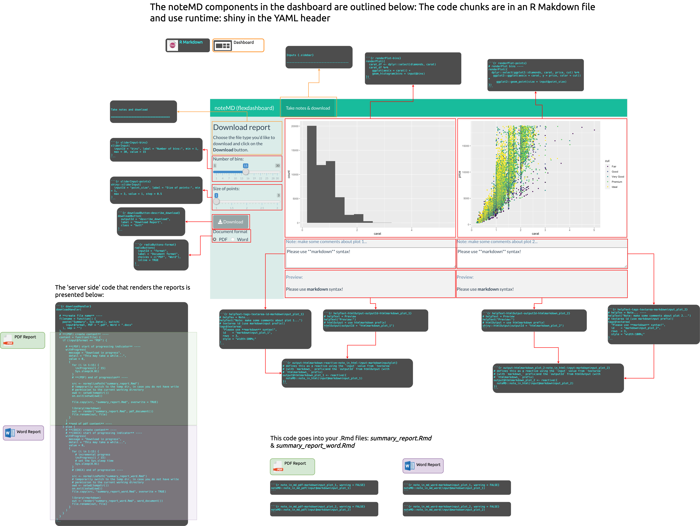

```{r setup, include=FALSE}
library(knitr)
library(kableExtra)
library(ggplot2)
library(memor)
# figures
fs::dir_create("img/")
# chunk options
knitr::opts_chunk$set(
  echo = TRUE,
  cache = FALSE,
  error = TRUE,
  prompt = FALSE,
  tidy = FALSE,
  comment = "#> ",
  message = FALSE,
  warning = FALSE, 
  fig.path = "img/")
```

# Packages

Load the packages below.

```{r packages, message=FALSE, warning=FALSE}
# app stuff ----
library(shiny)

# data wrangling ----
library(tidyverse)
library(janitor)


# app downloads -----
library(noteMD)
```

# Sidebar

The sidebar contains the two input controls:

-   Histogram bins `shiny::sliderInput()`

    -   This controls the numnber of `bins` in the
        `ggplot2::geom_histogram()`  
    -   accessible in to the `renderPlot({})` function via `input$bins`

-   Point size - `shiny::sliderInput()`

    -   This controls the numnber of `bins` in the
        `ggplot2::geom_point()`  
    -   accessible in to the `renderPlot({})` function via
        `input$point_size`

# Plot 1

```{r plot-1}
# draw the histogram with the specified number of bins
carat_df <- diamonds %>% dplyr::select(carat) 
carat_df %>% ggplot(aes(x = carat)) + geom_histogram(bins = bins[10])
```

## Note 1

To get the `noteMD` to render, we need three elements:

1.  the `tags$textarea()` includes an `id` that we define with a
    `markdowninput` prefix (`helpText()` optional)

```{r helpText-tags-textarea-id-markdowninput_plot_1, eval=FALSE}
# helpTex = Note... 
helpText("Note: make some comments about plot 1...")
# textarea use markdown prefix!
tags$textarea(
  "Please use **markdown** syntax!",
  id    = "markdowninput_plot_1",
  rows  = 3,
  style = "width:100%;"
)
```

1.  the `htmlOutput()` gets an `ouputId` with a `htmlmarkdown` prefix
    (`helpText()` optional)

```{r helpText-htmlOutput-outputId-htmlmarkdown_plot_1, eval=FALSE}
# helpText = Preview 
helpText("Preview:")
# htmlOutput = use htmlmarkdown_ prefix!
htmlOutput(outputId = "htmlmarkdown_plot_1")
```

1.  the `output$htmlmarkdown_plot_1` is from the
    `htmlOutput(outputId =)` in step 2, and the `reactive({})` contains
    the `markdowninput_plot_1` from `tags$textarea()` in step 1 (the
    `noteMD::note_in_html()` helps define the `input` in the reactive)

```{r output-htmlmarkdown_plot_1-reactive-note_in_html-input-markdowninput_plot_1, eval=FALSE}
# defines this as a reactive using the `input` value from `textarea` 
# (with `markdown_` prefix)and the `outputId` from htmlOutput (with 
# `htmlmarkdown_` prefix)
output$htmlmarkdown_plot_1 <- reactive({
  noteMD::note_in_html(input$markdowninput_plot_1)
})
```

## Plot 2

```{r plot-2}
ggplot2::diamonds %>% 
  ggplot2::ggplot(aes(x = carat, y = price, color = cut)) + 
    ggplot2::geom_point(size = 1)
```

## Note 2

This process is identical to the process above, but we need different
names.

1.  the `tags$textarea()` includes an `id` that we define with a
    `markdowninput` prefix, but with the `_plot_2` suffix (`helpText()`
    optional)

```{r helpText-tags-textarea-markdowninput_plot_2, eval=FALSE}
# helpTex = Note... 
helpText("Note: make some comments about plot 2...")
# textarea use markdown prefix!
tags$textarea(
  "Please use **markdown** syntax!",
  id    = "markdowninput_plot_2",
  rows  = 3,
  style = "width:100%;"
)
```

1.  the `htmlOutput()` gets an `ouputId` with a `htmlmarkdown` prefix,
    but with the `_plot_2` suffix (`helpText()` optional)

```{r helpText-htmlOutput-htmlmarkdown_plot_2, eval=FALSE}
# helpText = Preview 
helpText("Preview:")
# htmlOutput = use htmlmarkdown_ prefix!
htmlOutput("htmlmarkdown_plot_2")
```

1.  the `output$htmlmarkdown_plot_2` is from the
    `htmlOutput(outputId =)` in step 2, and the `reactive({})` contains
    the `markdowninput_plot_2` from `tags$textarea()` in step 1 (the
    `noteMD::note_in_html()` helps define the `input` in the reactive)

```{r output-htmlmarkdown_plot_2-note_in_html-input-markdowninput_plot_2, eval=FALSE}
# defines this as a reactive using the `input` value from `textarea` 
# (with `markdown_` prefix)and the `outputId` from htmlOutput (with 
# `htmlmarkdown_` prefix)
output$htmlmarkdown_plot_2 <- reactive({
  noteMD::note_in_html(input$markdowninput_plot_2)
})
```

# Rendering reports

The two .Rmd files contain the following code from the dashboard.

## PDF Note 1

```{r note_in_md_pdf-input-markdowninput_plot_1, eval=FALSE}
noteMD::note_in_md_pdf(input$markdowninput_plot_1)
```

## PDF Note 2

```{r note_in_md_pdf-markdowninput_plot_2, eval=FALSE}
noteMD::note_in_md_pdf(input$markdowninput_plot_2)
```

## Word Note 1

```{r note_in_md_word-markdowninput_plot_1, eval=FALSE}
noteMD::note_in_md_word(input$markdowninput_plot_1)
```

## Word Note 2

```{r note_in_md_word-markdowninput_plot_2, eval=FALSE}
noteMD::note_in_md_word(input$markdowninput_plot_2)
```

# Concept map

You can see a concept map of how all of these compenents fit together here on Github.

```{r noteMD-concept-map, echo=FALSE}

```
